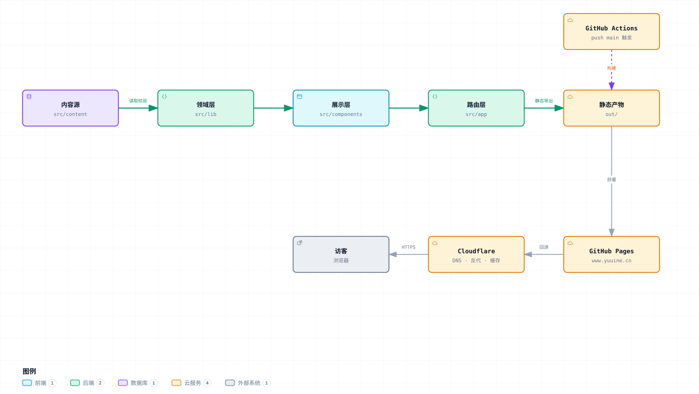

# 架构

Yuuine 个人站，包含文章、项目、关于三块。

核心特征：**构建期把 Markdown 渲染成静态 HTML，纯静态托管，运行期没有服务端、数据库和 API。**



> 可交互版本（缩放 / 明暗切换 / 路径高亮）：[architecture-diagram.html](architecture-diagram.html)
> 图源码：[architecture-diagram.json](architecture-diagram.json)

---

## 分层

两条分层规则，都是**单向依赖**，都禁止反向引用。

### 代码

```
app/  ──▶  views/  ──▶  components/  ──▶  lib/  ──▶  content/
```

| 层 | 允许 | 禁止 |
|---|---|---|
| `app/` | 定义路由、导出 metadata、按语言渲染 view | 内联业务逻辑、直接读文件系统 |
| `views/` | 取数据、拼页面、接收 `locale` | 引用 `app/`、被别的页面引用 |
| `components/` | 接收 props 渲染 | 取数据、读文件 |
| `lib/` | 纯函数、读 `content/`、字典 | 引用 `components/`、返回 JSX |
| `content/` | Markdown 与结构化数据 | — |

页面私有的模块放 `views/<页面>/`，不进 `components/`。判断依据是复用范围：首页的设计密度和其它页不是一个量级，把它专属的几何、动效放进共享层，共享层就不再是全站共用的了。目前只有 `views/home/` 一个。

### 样式

| 层 | 文件 | 职责 |
|---|---|---|
| L1 | `tokens.css` | 设计令牌。换肤只需改 `--hue-1st` / `--hue-2nd` |
| L2 | `base.css` | reset + 排版 + `.prose` |
| L3 | `components.css` | 全站共用的组件 |
| L4 | `pages/home.css`、`pages/inner.css`、`pages/docs.css` | 页面专属。首页一份，关于/项目一份，文章区外壳一份 |

颜色只能从 L1 的令牌取，L2–L4 禁止出现硬编码色值。

### 首页动效

按"它是什么"分文件，不集中在一处：

| 文件 | 职责 |
|---|---|
| `lib/wordmark.mjs` | 字标的静态几何（六个字形加圆点的路径数据，不含时序）。与 `lib/logo.mjs` 同为品牌资产的唯一来源 |
| `views/home/Wordmark.tsx` | 字标渲染，纯服务端组件 |
| `views/home/CodeMosaic.tsx` | 马赛克墙的静态渲染，服务端组件 —— 砖块和代码片段都不进客户端包 |
| `views/home/mosaic-shuffle.ts` | 华容道换块：空格游走、砖块滑动、何时停 |
| `views/home/MosaicShuffle.tsx` | 上面那套的客户端叶子（`'use client'` 下沉到叶子） |

两条硬约束：

- **动画属性必须能进合成器。** 只有 `transform` 和 `opacity` 走合成器，`offset-path`、`stroke-dashoffset` 这类都在主线程逐帧重画。所以字标那个点的起落（`wm-hop`）、马赛克换块（Web Animations），动的都是 `transform` 关键帧，不是路径动画。
- **滚出视口必须停。** 首页会停在下面读文章，看不见的墙不该继续跑。马赛克换块由 `IntersectionObserver` 控制启停。

## 路由与 URL 契约

| 路由 | 实现 |
|---|---|
| 中文（根路径） | `app/(zh)/**`，路由组不产生 URL 段 |
| `/en/**`、`/zh-TW/**` | `app/[lang]/**`，`generateStaticParams` 只返回这两种语言 |
| 文章区外壳 | `app/(zh)/(docs)/**` 与 `app/[lang]/(docs)/**` 各一个 `layout.tsx` |
| 19 条文章路径 | `app/**/[...slug]/page.tsx` + `generateStaticParams` + `dynamicParams = false` |
| `/sitemap.xml`、`/robots.txt` | 约定文件，静态导出下必须声明 `force-static` |

**文章索引、各分类页与每篇文章同属 `(docs)` 路由组**，共用 `components/DocsShell.tsx` 提供的左栏。组不产生路径段，所以这些 URL 一个都没变；关于与项目留在组外 —— 它们不是这本手册的章节。组内优先级与分组前一致：`articles` 是静态段，压过 `[...slug]`；`category/[name]` 是具名动态段，也压过 catch-all。

**中文留根路径是为了 URL 不迁移。** 静态导出做不了重定向，一旦给中文加前缀就没有退路。代价是路由分成两支，而 `<html>` 只能由 root layout 渲染，所以 `(zh)/layout.tsx` 与 `[lang]/layout.tsx` 各是一个 root layout：`<html>/<body>` 在 `components/RootShell.tsx`。

站点外壳（全局样式、预绘制脚本、页头、页脚、`<main>`）单独收在 `components/SiteChrome.tsx`：`out/404.html` 由 `app/not-found.tsx` 生成，而它落在两个 root layout 之外，不单拆一份就拿不到 `<html>` 和全局样式。代价是 404 页的 `<html lang>` 为空 —— `<html>` 只能由 root layout 渲染，这是两个 root layout 架构的固有约束。

**URL 由 front-matter 的 `permalink` 决定，与文件名无关。**

`dynamicParams = false` 是刻意的：不在 `generateStaticParams` 列表里的路径直接 404，catch-all 不会吞掉未定义路径。

## 文章区外壳

左栏两级折叠，状态存在两个不同的地方：

| | 存哪 | 为什么 |
|---|---|---|
| 整条左栏收起 | `<html data-nav>` + localStorage | 外壳在 layout 里、开关在组件里，中间隔着组件边界，只有写在 `<html>` 上的属性两边都够得着；而且它要在首次绘制前生效，由预绘制脚本写、CSS 直接读，布局不能等 hydration |
| 每个分组展开 | 只在内存里（React state） | 默认一律收起，不自动展开当前页所在的那一组；位置提示由标签自己承担 —— 当前组染主色。不落 localStorage 是有意的：落盘就得在预绘制阶段一并恢复，否则静态 HTML 先画出一堆展开的分组、hydration 后再折起来，会跳一下 |

宽度是按段落算出来的，改任何一个都要重算：

```
左栏 17rem + 正文 46rem + 目录 15rem ≈ 1328px
```

所以三栏的断点是 **1400px**；左栏收起后主列拿回整幅宽度，**1120px** 就够。目录"排不排得下"因此是「左栏收起 **或** 视口 ≥1400」—— 一个跨了两个断点的或，一条媒体查询表达不了，所以断点只负责给 `.article` 赋 `--toc-cols` / `--toc-display`，布局只写一遍。

**`.article` 任何时候都是网格，并且 `justify-content: center`。** 正文那一列锁死 46rem，容器一宽就空出一大截；不居中的话，收起目录后正文只是缩成一列，位置纹丝不动。同理，`--width-docs-main` 必须 ≥ 46rem + 15rem 加间距，否则收起左栏反而把目录挤没。

## 多语言

界面文案三语，文章正文目前只有中文。

| 关注点 | 做法 |
|---|---|
| 字典 | `lib/dictionaries/{zh-CN,zh-TW,en}.ts`，类型由简中推导，漏字段构建期报错 |
| 取词 | `getDictionary(locale)`，组件接收 `locale` 或文案 props |
| 路径 | 一律写「默认语言下的路径」，渲染时过 `localeHref(locale, path)` |
| 未翻译内容 | `buildMetadata({ translated: false })`：canonical 收敛回中文原文且不发 hreflang |
| 切换器 | `LanguageSwitcher` 基座是 `<details>`，原生开合、无 JS 可用；只补了原生缺的点外部关闭与 Esc 关闭。href 由 `usePathname()` 剥掉当前语言前缀得到，在文章页也能停在原篇 |

---

其余文档：[README](../README.md)（跑起来 / 写内容 / 部署）、[CLAUDE.md](../CLAUDE.md)（开发约定与工作准则）。
