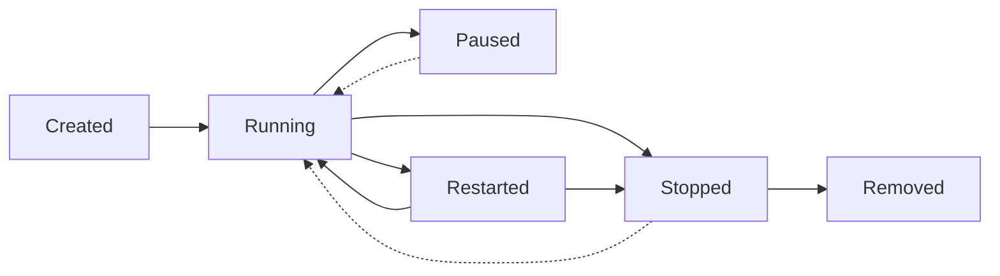

# Docker 容器化入门

## 一、什么是容器化

### 1. 简介

**容器化**（Containerization）是一种**操作系统级虚拟化技术**，它允许将应用程序及其完整的运行时环境（包括代码、二进制文件、库、配置文件等）打包到一个轻量级、可移植、自包含的执行单元中，这个单元称为**容器**（Container）。

与传统虚拟机（Virtual Machine, VM）不同，容器**不模拟硬件，也不包含完整的客户操作系统**。相反，容器直接运行在宿主机的操作系统内核之上，通过内核提供的机制实现**进程隔离**和**资源限制**。其核心技术包括：

- **Namespaces**（命名空间）：  
  提供隔离视图，使每个容器拥有独立的进程 ID、网络接口、挂载点、用户 ID 和主机名等。例如，`pid` namespace 隔离进程列表，`net`namespace 隔离网络栈。

- **Control Groups**(cgroups)：  
  限制、记录和隔离进程组对 CPU、内存、磁盘 I/O 和网络带宽等系统资源的使用，防止某个容器耗尽宿主机资源。

- **Union File Systems**(UnionFS)：  
  如 OverlayFS、AUFS，支持镜像的分层存储。每一层代表一次变更（如安装软件、复制文件），多层叠加形成最终文件系统，实现高效构建与共享。

容器一旦启动，即作为一个独立进程运行在宿主机上，具有**快速启动**（毫秒级）、**低开销**（几乎无性能损耗）和**高密度部署**（单机可运行数百个容器）的特点。

---

### 2. 我们为什么需要容器化？

#### 环境一致性

开发、测试、预发、生产环境往往存在差异（如操作系统版本、依赖库、配置文件）。容器将环境"固化"在镜像中，确保应用在任何支持容器运行时的平台上行为一致。

#### 依赖隔离与冲突避免

多个应用可能依赖同一软件的不同版本（如 jdk 1.8 与 17）。容器提供独立的文件系统和运行时，彻底避免"依赖地狱"。

#### 快速部署与弹性伸缩

容器镜像可预先构建并缓存，部署仅需拉取镜像并启动进程，无需复杂的安装脚本。结合编排系统（如 Kubernetes），可实现秒级扩缩容，应对流量高峰。

#### 资源利用率提升

相比虚拟机（每台需分配完整 OS 资源），容器共享宿主机内核，内存和 CPU 开销极低，显著提高服务器资源利用率，降低基础设施成本。

#### 支持现代架构范式

微服务、Serverless、CI/CD 等云原生实践高度依赖容器化：

- 每个微服务可独立打包、部署、升级；
- CI 流水线可在一个干净、可复现的容器环境中运行测试；
- 应用交付单元从"包 + 配置脚本"简化为"一个镜像"。

---

容器化是一种以**应用为中心**的交付与运行范式，通过操作系统级隔离机制，实现了**轻量、可移植、一致、高效**的软件部署。

> 容器不是"更小的虚拟机"，而是**将应用与其运行契约显式声明并封装的工程实践**。

下面我将重点介绍目前最流行的容器化平台——**Docker**。

## 二、Docker 核心概念

### 2.1 Docker 简介

**Docker** 是一个开源的**容器化平台**，用于将应用程序及其所有依赖（包括代码、运行时、系统工具、库和配置）打包到一个标准化的、可移植的**容器**（Container）中，从而实现"**一次构建，随处运行**"（Build Once, Run Anywhere）。

Docker 于 2013 年首次发布，迅速成为容器化技术的事实标准。它不仅提供了容器运行时，还提供了一整套生态系统，包括镜像构建、容器编排、服务发现等功能，极大地简化了应用的开发、测试和部署流程。

Docker 的核心价值在于：

- **简化部署**：将应用及其依赖打包到轻量级、可移植的容器中
- **环境一致性**：确保应用在开发、测试、生产环境中的行为一致
- **资源利用率**：相比虚拟机，容器共享宿主机内核，资源开销更小
- **快速启动**：容器启动时间通常在秒级，适合弹性伸缩场景

### 2.2 Docker 核心组件

Docker 系统由多个核心组件构成，形成了完整的容器化生态系统：

#### 2.2.1 **Docker Engine**

- **定义**：Docker 的核心守护进程，负责容器的生命周期管理
- **功能**：
    - 镜像构建与管理（build, pull, push）
    - 容器创建与运行（run, start, stop）
    - 网络与存储管理
    - 安全策略执行
- **架构**：
    - **Server**：守护进程（dockerd），接收 API 请求并管理对象
    - **REST API**：定义与 Docker 守护进程通信的接口
    - **Client**：命令行工具（docker CLI），向守护进程发送请求

#### 2.2.2 **Docker Images**（镜像）

- **定义**：只读模板，包含运行应用所需的所有内容（代码、运行时、库、环境变量、配置文件）
- **特性**：
    - **分层存储**：基于 Union File System，每层代表一次变更
    - **可共享**：多镜像可共享公共层，节省存储空间
    - **不可变性**：镜像一旦构建，内容无法修改，只能基于其构建新镜像
- **镜像标识**：
    - 格式：`[registry/][namespace/]repository[:tag]`
    - 示例：`nginx:latest`、`mycompany/myapp:v1.2.3`

#### 2.2.3 **Docker Containers**（容器）

- **定义**：镜像的运行实例，是真正执行应用的实体
- **生命周期**：
    - 创建（create）→ 启动（start）→ 运行（running）→ 停止（stop）→ 删除（rm）
- **特性**：
    - **隔离性**：独立的文件系统、网络栈、进程空间
    - **资源限制**：可通过 cgroups 控制 CPU、内存、I/O 使用
    - **临时性**：除非使用数据卷，否则容器删除后数据丢失

#### 2.2.4 **Docker Registry**（镜像仓库）

- **作用**：存储和分发 Docker 镜像的中央仓库
- **类型**：
    - **公共仓库**：Docker Hub（官方）、Quay.io
    - **私有仓库**：Harbor、Docker Trusted Registry、自建仓库
    - **云厂商仓库**：AWS ECR、Google GCR、Azure ACR
- **功能**：
    - 镜像版本管理（标签系统）
    - 访问控制与安全扫描
    - 镜像缓存与加速

### 2.3 Docker 镜像构建机制

Docker 镜像的构建基于**分层存储**和**写时复制**（Copy-on-Write）机制，这是其高效性的核心：

#### 2.3.1 **镜像分层结构**

```text
┌─────────────────┐  
│    Container    │  ← 容器层（可写）
├─────────────────┤
│    Layer N      │  ← 应用层（只读）
├─────────────────┤
│    Layer N-1    │  ← 运行时层（只读）
├─────────────────┤
│    Layer ...    │  ← 依赖层（只读）
├─────────────────┤
│    Layer 1      │  ← 基础系统层（只读）
├─────────────────┤
│    Base Layer   │  ← 操作系统层（只读）
└─────────────────┘
```

- **基础层**：通常是操作系统（如 Ubuntu、Alpine Linux）
- **中间层**：安装依赖包、运行时环境
- **应用层**：应用程序代码与配置
- **容器层**：运行时产生的修改（临时）

#### 2.3.2 **Dockerfile 指令详解**

Dockerfile 是构建镜像的文本文件，包含一系列构建指令：

| 指令             | 作用                | 示例                                              |
|----------------|-------------------|-------------------------------------------------|
| **FROM**       | 指定基础镜像            | `FROM ubuntu:20.04`                             |
| **RUN**        | 执行命令并创建新层         | `RUN apt-get update && apt-get install -y curl` |
| **COPY**       | 从本地复制文件到镜像        | `COPY . /app`                                   |
| **ADD**        | 高级复制（支持 URL、自动解压） | `ADD app.tar.gz /app/`                          |
| **CMD**        | 指定容器启动时的默认命令      | `CMD ["python", "app.py"]`                      |
| **ENTRYPOINT** | 配置容器启动入口点         | `ENTRYPOINT ["/usr/local/bin/python"]`          |
| **ENV**        | 设置环境变量            | `ENV NODE_ENV=production`                       |
| **EXPOSE**     | 声明容器监听端口          | `EXPOSE 8080`                                   |
| **VOLUME**     | 创建挂载点             | `VOLUME ["/data"]`                              |
| **WORKDIR**    | 设置工作目录            | `WORKDIR /app`                                  |
| **LABEL**      | 添加元数据标签           | `LABEL version="1.0"`                           |

#### 2.3.3 **构建缓存与优化**

Docker 在构建过程中使用缓存机制提升效率：

- **缓存原理**：每条指令会与前一层进行比较，若完全一致则复用缓存
- **优化策略**：
    - 将变化较少的层放在 Dockerfile 前面
    - 将 `COPY package.json .` 和 `RUN npm install` 放在一起，利用依赖缓存
    - 使用 `.dockerignore` 文件排除不必要的文件
    - 采用多阶段构建（Multi-stage Build）减少最终镜像大小

### 2.4 Docker 网络机制

Docker 提供多种网络模式以满足不同场景需求：

#### 2.4.1 **内置网络驱动**

- **Bridge**（桥接网络）：
    - 默认网络模式，容器通过虚拟网桥连接
    - 容器间可通过 IP 通信，外部需端口映射访问
    - 适用于单机部署场景

- **Host**（主机网络）：
    - 容器直接使用宿主机网络栈
    - 无网络性能损耗，但端口冲突需注意
    - 适用于性能敏感场景

- **None**（无网络）：
    - 容器无网络接口，完全隔离
    - 适用于安全隔离场景

- **Overlay**（覆盖网络）：
    - 支持跨主机容器通信
    - 用于 Docker Swarm 集群

#### 2.4.2 **自定义网络**

自定义网络提供了更灵活的容器间通信方案，可以实现网络隔离和更精细的控制。

### 2.5 Docker 数据管理

容器的临时性要求我们妥善处理数据持久化：

#### 2.5.1 **数据卷（Volumes）**

- **特点**：
    - Docker 管理的持久化数据存储
    - 跨容器共享，独立于容器生命周期
    - 支持性能优化和备份

#### 2.5.2 **绑定挂载（Bind Mounts）**

- **特点**：
    - 直接挂载宿主机目录到容器
    - 适合开发调试和配置文件共享
    - 宿主机路径必须存在

#### 2.5.3 **临时文件系统（tmpfs）**

- **特点**：
    - 数据仅存储在宿主机内存中
    - 容器停止后数据丢失
    - 适合存储敏感信息（如密钥）

## 三、Docker 实践操作

### 3.1 Docker 容器管理

Docker 容器的生命周期管理是日常操作的核心：

#### 3.1.1 **容器生命周期**



#### 3.1.2 **常用管理命令**

| 命令                 | 作用         | 示例                                    |
|--------------------|------------|---------------------------------------|
| **docker run**     | 创建并启动容器    | `docker run -d -p 80:80 nginx`        |
| **docker start**   | 启动已停止容器    | `docker start container_name`         |
| **docker stop**    | 优雅停止容器     | `docker stop container_name`          |
| **docker kill**    | 强制终止容器     | `docker kill container_name`          |
| **docker ps**      | 查看运行中容器    | `docker ps -a` (查看所有)                 |
| **docker exec**    | 在运行容器中执行命令 | `docker exec -it container_name bash` |
| **docker logs**    | 查看容器日志     | `docker logs -f container_name`       |
| **docker inspect** | 查看容器详细信息   | `docker inspect container_name`       |

#### 3.1.3 **资源限制与监控**

Docker 提供多种资源限制选项：

```bash
# 限制 CPU 和内存
docker run -m 512m --cpus=1.5 --memory-swap=1g myapp

# 限制磁盘 I/O
docker run --blkio-weight=300 myapp

# 查看容器资源使用情况
docker stats container_name
```

### 3.2 Docker 网络实践

#### 3.2.1 **自定义网络操作**

```bash
# 创建自定义桥接网络
docker network create --driver bridge mynetwork

# 容器连接到网络
docker run --network mynetwork myapp

# 查看网络列表
docker network ls
```

### 3.3 Docker 数据管理实践

#### 3.3.1 **数据卷操作**

```bash
# 创建并使用数据卷
docker volume create mydata
docker run -v mydata:/app/data myapp
```

#### 3.3.2 **绑定挂载操作**

```bash
# 绑定挂载示例
docker run -v /host/path:/container/path myapp
```

#### 3.3.3 **tmpfs 挂载操作**

```bash
# tmpfs 挂载示例
docker run --tmpfs /tmp:rw,noexec,nosuid,size=100m myapp
```