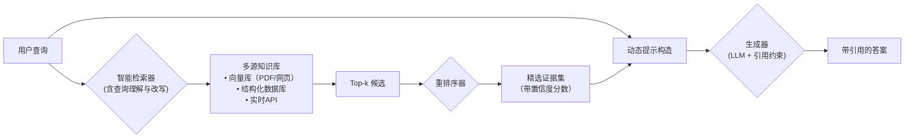

# RAG 概述

## 一、引言

**Retrieval-Augmented Generation (RAG)，即检索增强生成，是一种使用来自私有或专有数据源的信息来补充文本生成的技术**。用于优化大型语言模型（Large Language Models, LLMs）的输出性能。它通过将外部知识库与生成模型相结合，使模型能够在不重新训练的情况下访问特定领域或实时更新的信息，从而提升响应的准确性、相关性和可靠性。
RAG 的核心在于桥接信息检索系统（如搜索和数据库）和生成模型的优势，允许模型从外部数据源中检索相关事实，并将其融入生成过程中。这使得 RAG 特别适用于需要事实的应用场景，例如聊天机器人、企业知识管理系统或实时查询工具。

---

## 二、为什么需要 RAG ？

大语言模型（Large Language Models, LLMs）在自然语言理解与生成任务中展现出强大能力，但其固有局限性在**知识密集型（knowledge-intensive）场景**中尤为突出。为克服这些限制，**检索增强生成（RAG）** 被提出并广泛应用。其核心动因可归纳为以下三点：

### 1. **缓解幻觉（Hallucination）问题**

LLMs 基于概率建模生成文本，在缺乏明确依据时易产生“看似合理但错误”的回答（即幻觉）。
RAG 将生成过程锚定于**可验证的外部证据**（如企业文档、政策文件、实时数据库），显著降低事实性错误。结合后验校验（如 NLI 判别、引用溯源），系统可进一步过滤不可靠输出。

### 2. **突破静态知识边界**

LLMs 的知识截止于其训练数据的时间点（即“知识冻结”），无法获取**训练后的新事件、动态数据或私有领域知识**（如公司内部文档、用户个人资料）。  
RAG 通过**解耦知识存储与模型参数**，实现“模型不变、知识常新”——只需更新向量库或结构化数据源，即可让系统即时掌握新信息。

### 3. **提升可解释性与可控性**

在 RAG 架构中，生成结果可追溯至具体的检索证据（retrieved passages），这为系统提供了**天然的可解释性（explainability）**。  
运维人员或用户可审查所用依据，判断答案可靠性；开发者亦可通过优化检索器（如调整召回策略、过滤低质量文档）**精细调控生成内容的质量与范围**，而无需修改复杂的语言模型本身。

---

### 说明：RAG 与微调（Fine-tuning）的对比

| 维度          | 微调（Fine-tuning）     | RAG                      |
|-------------|---------------------|--------------------------|
| **核心目标**    | 优化“如何说”（风格、格式、任务对齐） | 解决“说什么”（事实、数据、知识）        |
| **知识更新成本**  | 高（需重新训练、评估、部署）      | 极低（仅更新知识库，秒级生效）          |
| **私有数据安全性** | 风险高（数据混入模型，难隔离）     | 安全（检索时按需访问，支持 RBAC 权限控制） |
| **事实准确性**   | 依赖模型记忆，易过时          | 依赖实时证据，准确率高              |
| **典型场景**    | 客服话术定制、代码风格迁移、摘要模板化 | 企业知识问答、法律/医疗咨询、实时数据查询    |

> **当前共识**：RAG 与微调并非互斥，而是分层协同——微调用于任务对齐，RAG 用于知识供给。部分系统甚至采用 **RAG + LoRA 微调** 的混合方案，兼顾效率与精度。

---

## 三、RAG 的工作原理

RAG（Retrieval-Augmented Generation）是一种**将信息检索与语言生成相结合的混合架构**。

其核心思想是：在生成答案前，先从外部知识库中检索与用户查询最相关的文档片段，并将这些片段作为上下文输入给生成模型，从而引导其输出**事实准确、证据可溯**的回答。

现在 RAG 系统已超越早期的两阶段（检索 + 生成）流水线，发展为支持**迭代检索、多源融合、置信度反馈**的闭环架构。



### 1. 检索阶段（Retrieval）

- **输入**：原始查询 $ q $
- **增强处理**：
    - **查询理解**：识别实体、意图、时间敏感性（如 “最新”、“2025年”）
    - **查询改写**：使用 LLM将模糊问句转为明确检索语句（e.g., “它合规吗？” → “2025年欧盟AI法案对医疗AI的合规要求”）
- **多路检索**：
    - **稠密检索**：
    - **稀疏检索**：
    - **混合检索**：加权融合稠密与稀疏得分，提升召回多样性
- **索引后端**：FAISS（本地）、Pinecone（云托管）、Milvus（开源向量数据库），均支持**带元数据的过滤检索**。

---

### 2. 生成阶段（Generation）

- **输入构造**：采用**引用感知提示模板**（citation-aware prompting），例如：
  ```text
  根据以下资料回答问题，并在句末标注引用编号：
  
  [1] 《欧盟AI法案（2025修订版）》第12条：高风险AI系统须通过独立第三方认证。
  [2] 欧盟委员会2025年4月指南：医疗诊断AI属于高风险类别。
  
  问题：2025年欧盟新出台的AI法案对医疗诊断系统有何影响？
  答案：
  ```
- **生成模型**：
    - **云端模型**
    - **私有部署**
- **输出控制**：
    - **引用强制**：通过 constrained decoding 确保每句均有依据
    - **幻觉检测**：调用轻量 NLI 模型验证前提-结论一致性
    - **置信度评分**：基于检索相关性与生成一致性输出可信度（0–1）

---

### 3. 形式化定义

$$
P(a, \mathcal{E} \mid q) = \sum_{\mathcal{D}' \subseteq \mathcal{D}} P(\mathcal{D}' \mid q) \cdot P(a, \mathcal{E} \mid q, \mathcal{D}')
$$

其中：

- $ \mathcal{D}' $ 为从知识库 $ \mathcal{D} $ 中选出的证据子集；
- $ \mathcal{E} $ 为显式引用标记（如 `[1]`）；
- $ P(\mathcal{D}' \mid q) $ 由**检索器 + 重排序器**联合建模；
- 实际系统采用**Top-$k$ 近似 + 置信度过滤**，避免组合爆炸。

---

## 四、关键组件说明

### 1. 知识库（Knowledge Source）

**类型扩展**：

- **非结构化文本**：PDF、Word、网页（经 Unstructured.io 或 LlamaIndex 解析）
- **结构化数据**：SQL 数据库、NoSQL（通过 text-to-SQL 或向量化字段接入）
- **实时 API**：天气、股价、新闻流（通过 function calling 动态注入）
- **多模态内容**：图像 OCR 文本、音频转录（统一嵌入到文本向量空间）

**预处理最佳实践**：

- 使用**语义分块**（semantic chunking）替代固定长度切分（如基于句子嵌入聚类）
- 添加**丰富元数据**：来源、作者、更新时间、权限标签、可信度等级
- 支持**增量更新与版本控制**（如使用 LangChain 的 Ingestion Pipeline）

> **最佳实践**：避免跨语义边界的硬切分（如在句子中间截断）

---

### 2. 检索器（Retriever）

**职责**
- 将用户查询 $ q $ 映射到知识库中最相关的文档片段集合 $ \{d_i\} $；
- 平衡**召回率**（Recall）与**精度**（Precision）。

**技术分类**

| 类型       | 核心特征             | 优势                 | 局限             |
|----------|------------------|--------------------|----------------|
| **稠密检索** | 基于语义向量相似度进行匹配    | 语义泛化能力强，支持跨语言与同义表达 | 计算成本较高，系统资源要求高 |
| **稀疏检索** | 基于关键词与词项统计进行匹配   | 精确度高，资源消耗低         | 难以处理语义改写与隐含表达  |
| **混合检索** | 结合语义匹配与关键词匹配     | 召回更全面，整体准确性更高      | 架构复杂度与调优成本增加   |
| **递归检索** | 基于上下文或元数据进行多阶段检索 | 能动态缩小检索范围，提高相关性    | 强依赖知识组织与元数据质量  |

**高级功能**：
- **查询路由**（Query Routing）：判断是否需检索（如闲聊 vs 事实问答）
- **多跳检索**（Multi-hop）：基于初步答案生成子查询，迭代检索（用于复杂推理）
- **检索缓存**：对高频查询缓存结果，降低延迟与成本

---

### 3. 生成器（Generator）

**模型选择思路**：

- **通用场景**：选择具备稳定语言生成能力、较低响应延迟，并能够在长上下文条件下保持事实一致性的通用大模型。
- **私有部署场景**：选择支持本地部署、可控性强、并可通过任务微调或参数高效适配方式与检索系统深度结合的模型。
- **资源受限或边缘场景**：选择参数规模较小、推理开销低、但仍具备基础理解与生成能力的轻量化模型。

无论具体选型如何，生成器在 RAG 系统中的核心职责并非“记忆知识”，而是**在强上下文约束下，对检索结果进行归纳、重组与表达**。

**提示工程演进**：
- 从简单拼接到 **XML/JSON 结构化上下文**
- 引入 **system prompt 约束**：“仅基于提供的资料回答，若无相关信息请回答‘未知’”
- 支持 **多文档交叉验证**：“若多个来源一致，则提高置信度”

---

### 4. 增强组件

| 组件            | 功能说明                                                 |
|---------------|------------------------------------------------------|
| **智能重排序器**    | 对 Top-k 结果重排，提升 top 精度                               |
| **查询扩展模块**    | 基于 LLM 自动生成同义查询或子问题                                  |
| **引用验证器**     | 后处理阶段检查生成内容是否真实存在于检索结果中                              |
| **Agent 控制层** | 在 RAG 基础上引入 ReAct 或 Plan-and-Execute，实现“检索→推理→再检索”闭环 |

---
