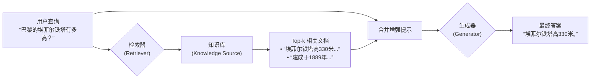
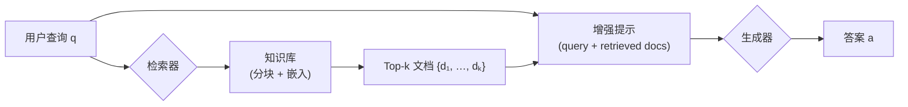

# RAG 概述

## 一、引言

**Retrieval-Augmented Generation (RAG)，即检索增强生成，是一种使用来自私有或专有数据源的信息来补充文本生成的技术**。用于优化大型语言模型（Large Language Models, LLMs）的输出性能。它通过将外部知识库与生成模型相结合，使模型能够在不重新训练的情况下访问特定领域或实时更新的信息，从而提升响应的准确性、相关性和可靠性。

RAG 的核心在于桥接信息检索系统（如搜索和数据库）和生成模型的优势，允许模型从外部数据源中检索相关事实，并将其融入生成过程中。这使得

RAG 特别适用于需要事实的应用场景，例如聊天机器人、企业知识管理系统或实时查询工具。

---

## 二、为什么要使用 RAG ？

大语言模型（Large Language Models, LLMs）在自然语言理解与生成任务中展现出强大能力，但其固有局限性在**知识密集型（knowledge-intensive）场景**中尤为突出。为克服这些限制，**检索增强生成（RAG）** 被提出并广泛应用。其核心动因可归纳为以下三点：

### 1. **缓解幻觉（Hallucination）问题**

LLMs 本质上是基于统计模式生成文本，当面对训练数据中未覆盖或模糊的事实时，容易生成看似合理但**事实错误的内容**（即“幻觉”）。  
RAG 通过在生成前从**可信外部知识源**（如企业文档库、维基百科、数据库）中检索相关证据，将生成过程锚定于真实信息，显著降低事实性错误率。

### 2. **突破静态知识边界**

LLMs 的知识截止于其训练数据的时间点（即“知识冻结”），无法获取**训练后的新事件、动态数据或私有领域知识**（如公司内部文档、用户个人资料）。  
RAG 将语言模型与**可更新的外部知识库解耦**，使得系统无需重新训练即可：

- 实时接入最新信息；
- 定制化集成垂直领域专有数据；
- 支持多租户场景下的个性化知识注入。

### 3. **提升可解释性与可控性**

在 RAG 架构中，生成结果可追溯至具体的检索证据（retrieved passages），这为系统提供了**天然的可解释性（explainability）**。  
运维人员或用户可审查所用依据，判断答案可靠性；开发者亦可通过优化检索器（如调整召回策略、过滤低质量文档）**精细调控生成内容的质量与范围**，而无需修改复杂的语言模型本身。

---

### 说明：RAG 与微调（Fine-tuning）的对比

| 维度         | 微调（Fine-tuning）    | RAG             |
|------------|--------------------|-----------------|
| **知识更新成本** | 高（需重新训练/部署模型）      | 低（仅更新知识库）       |
| **私有知识支持** | 需将私有数据混入训练集，存在泄露风险 | 知识隔离，按需检索       |
| **事实准确性**  | 依赖模型记忆，易过时或出错      | 依赖外部证据，实时准确     |
| **适用场景**   | 任务风格适配（如语气、格式）     | 事实性问答、文档问答、知识推理 |

> **RAG 并非替代微调，而是与其互补**：微调优化“如何说”，RAG 解决“说什么”。

---

## 三、RAG 的工作原理

RAG（Retrieval-Augmented Generation）是一种**将信息检索与语言生成相结合的混合架构**
。其核心思想是：在生成答案前，先从外部知识库中检索与用户查询最相关的文档片段，并将这些片段作为上下文输入给生成模型，从而引导其输出
**事实准确、证据可溯**的回答。

整个流程可分为两个阶段：**检索（Retrieval）** 与 **生成（Generation）**，如下图所示：



### 1. 检索阶段（Retrieval）

- **输入**：用户原始查询 $ q $。
- **过程**：
    - 查询 $ q $ 被编码为稠密向量（通常采用双塔架构模型，如 **DPR**（Dense Passage Retriever）或 **SBERT**）；
    - 在**预先构建索引的外部知识库**（例如 Wikipedia、企业知识库或私有文档集合）中执行**近似最近邻搜索**（Approximate
      Nearest Neighbor, ANN），召回与查询语义最相关的 Top-$k$ 个文档片段 $ \{d_1, d_2, \dots, d_k\} $。
- **输出**：一组作为证据支持的候选文档。

> **注**：知识库通常以“嵌入向量 + 原始文本”形式存储。常用索引后端包括 **FAISS**、**Annoy** 或 **Elasticsearch**。

---

### 2. 生成阶段（Generation）

- **输入**：原始查询 $ q $ 与检索得到的文档集合 $ \{d_i\}_{i=1}^k $ 被组合为结构化提示（prompt），例如：

```text
  文档：埃菲尔铁塔高330米，包括天线。
  问题：巴黎的埃菲尔铁塔有多高？
  答案：
```

- **过程**：
    - 生成器（如 **T5**、**BART** 等 Seq2Seq 模型，或 **LLaMA**、**GPT** 等 Decoder-only 架构）基于该上下文生成自然语言答案；
    - 该过程可建模为条件概率 $ P(a \mid q, d_i) $，其中 $ a $ 为生成的答案。
- **输出**：一个受检索证据约束、事实性更强的自然语言响应。

---

### 3. 形式化定义

RAG 模型的目标是最大化以下**边际似然**（marginal likelihood）：

$$
P(a \mid q) = \sum_{d \in \mathcal{D}} P(d \mid q) \cdot P(a \mid q, d)
$$

其中：

- $ \mathcal{D} $ 表示整个外部知识库；
- $ P(d \mid q) $ 由**检索器**（retriever）建模，反映文档 $ d $ 与查询 $ q $ 的相关性；
- $ P(a \mid q, d) $ 由**生成器**（generator）建模，表示在给定查询和文档条件下生成答案的概率。

由于知识库 $ \mathcal{D} $ 规模庞大（常达数百万至数十亿文档），实际计算中仅对 Top-$k$ 检索结果进行近似求和：

$$
P(a \mid q) \approx \sum_{i=1}^{k} P(d_i \mid q) \cdot P(a \mid q, d_i)
$$

---

## 四、关键组件说明

### 1. 知识库（Knowledge Source）

**职责**
- 存储用于检索的**结构化或非结构化文本数据**；
- 作为事实性知识的来源，支撑问答、摘要、推理等任务。

**数据形式**
- **原始文档**：PDF、Word、网页、数据库记录、Markdown 文件等；
- **预处理后片段**：通常被切分为固定长度（如 256–512 tokens）的文本块（chunks），以适配嵌入模型和上下文窗口。

**典型构建流程**
1. **数据采集**：从内部系统或公开源收集原始内容；
2. **清洗与标准化**：去除噪声、统一编码、提取正文；
3. **分块（Chunking）**：按语义边界（如段落、标题）或固定长度切分；
4. **元数据标注（可选）**：添加来源 URL、作者、时间戳等，用于后续过滤或溯源。

> **最佳实践**：避免跨语义边界的硬切分（如在句子中间截断）。

---

### 2. 检索器（Retriever）

**职责**
- 将用户查询 $ q $ 映射到知识库中最相关的文档片段集合 $ \{d_i\} $；
- 平衡**召回率**（Recall）与**精度**（Precision）。

**技术分类**

| 类型 | 原理 | 代表方法 | 适用场景 |
|------|------|--------|--------|
| **稀疏检索** | 基于词频/TF-IDF 或 BM25 | Elasticsearch, Lucene | 关键词匹配强、无需训练 |
| **稠密检索** | 基于向量相似度（如余弦） | DPR, SBERT, ColBERT | 语义匹配、支持同义/ paraphrase |
| **混合检索** | 稀疏 + 稠密融合 | SPLADE + FAISS, Hybrid Search in Vespa | 高精度要求场景 |

**核心子模块**
- **查询编码器**（Query Encoder）：将 $ q $ 编码为向量 $ \mathbf{q} \in \mathbb{R}^d $；
- **文档编码器**（Document Encoder）：预先将所有文档块编码为向量并建立索引；
- **索引系统**：支持高效 ANN 搜索，常用工具包括：
  - **FAISS**（Facebook）：高性能 CPU/GPU 向量索引；
  - **Annoy**（Spotify）：轻量级，适合中小规模；
  - **Pinecone / Weaviate / Milvus**：托管向量数据库，支持过滤、更新、多租户。

> **注意**：稠密检索需确保查询与文档使用**同一嵌入模型**，否则向量空间不一致导致性能下降或者直接无法查询。

---

### 3. 生成器（Generator）

**职责**
- 基于检索结果 $ \{d_i\} $ 与原始查询 $ q $，生成自然语言答案 $ a $；
- 控制输出风格、长度、事实一致性。

**模型类型**

| 类型 | 特点 | 代表模型 | 是否需微调 |
|------|------|--------|----------|
| **Seq2Seq** | 编码器-解码器架构，天然支持条件生成 | T5, BART | 可端到端训练（如原始 RAG） |
| **Decoder-only LLM** | 仅解码器，依赖 prompt 工程 | LLaMA, GPT, Qwen | 通常 zero-shot 使用 |

**输入构造方式**
生成器的输入通常为拼接后的提示（prompt）：
```text 
[检索文档 1]
[检索文档 2]
...
问题：{query}
答案：
```

**输出控制**
- **约束解码**：强制答案来自检索内容（如使用 `LLM + Reranker + Extractive Head`）；
- **后处理校验**：通过 NLI 模型或规则检查幻觉。

---

### 组件协同工作流程



1. 用户发起查询 $ q $；
2. 检索器从知识库中召回相关文档；
3. 生成器融合 $ q $ 与 $ \{d_i\} $ 生成最终答案。

---

### 补充：可选增强组件

| 组件 | 作用 |
|------|------|
| **重排序器**（Reranker） | 对 Top-$k$ 结果二次打分（如 Cohere Rerank, BGE-Reranker），提升 top-1 精度 |
| **查询扩展/改写模块** | 将模糊查询转为明确形式（如 “它多高？” → “埃菲尔铁塔高度？”） |
| **缓存层** | 缓存高频查询的检索结果，降低延迟与成本 |

---